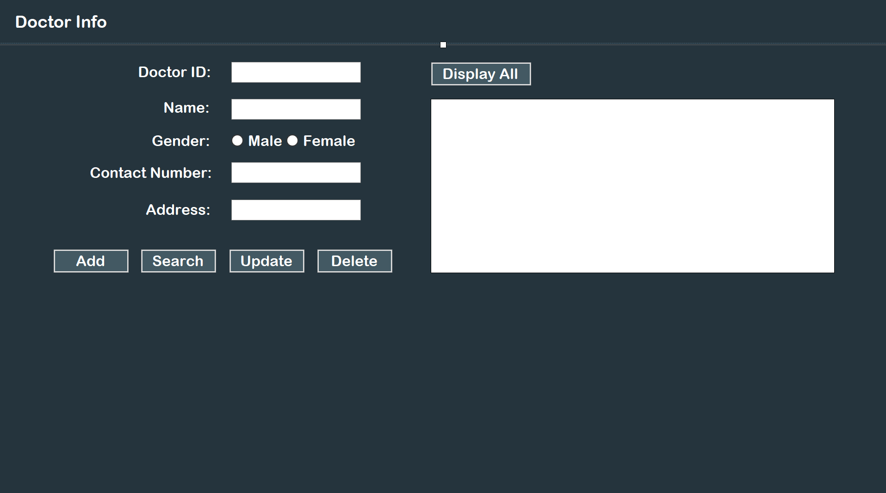
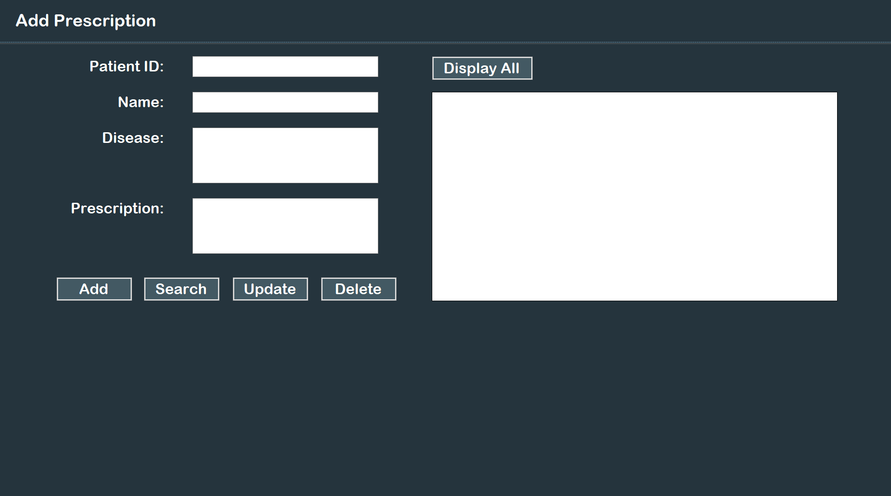

# Clinic Management System
The Oceana Clinic Management System is developed using Visual Basic .NET.

 

## Features
* Login authentication
* Manage user account (Admin, Staff Nurse & Doctor)
* Manage patient info
* Manage prescription
* Manage and generate bill

 

## Screenshots
### All Users
#### Login

 

### Admin
#### Admin Homepage

#### Manage Admin User Account

#### Manage Staff Nurse User Account

#### Manage Doctor User Account

#### Manage Patient Info

 

### Staff Nurse
#### Staff Nurse Homepage

#### Prescription List

#### Bill

 

### Doctor
#### Doctor Homepage

#### Manage Prescription

